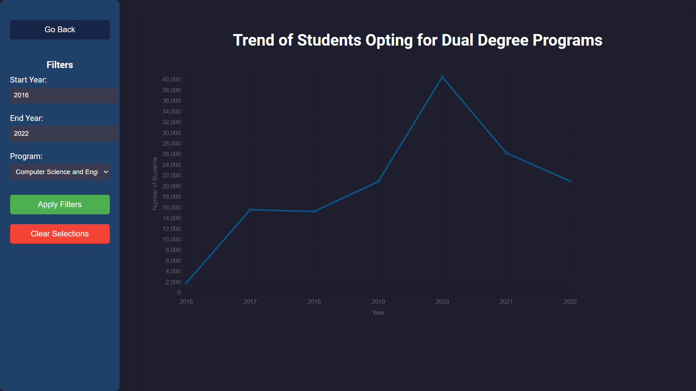
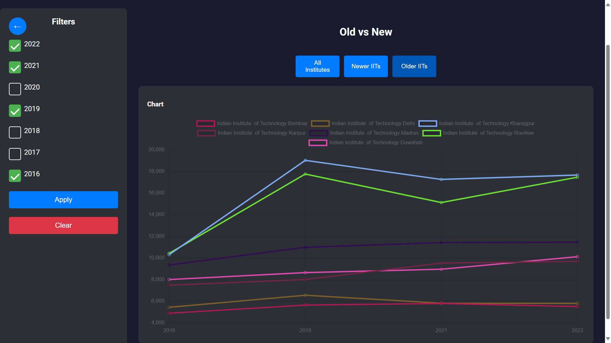
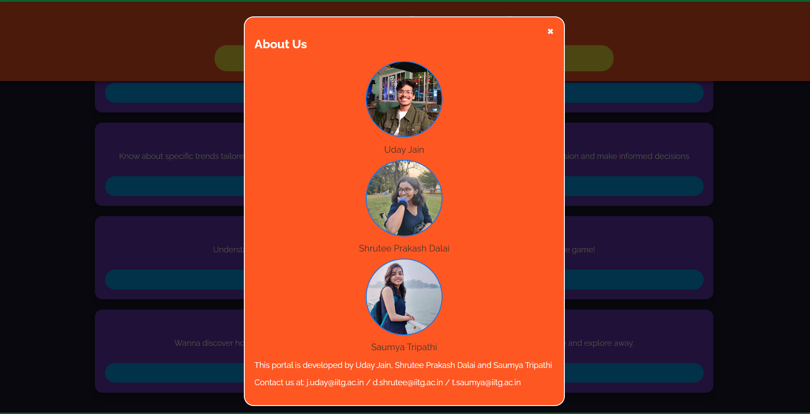

# <pre>            Josaa_Anaylsis_Portal</pre>

## <pre>Project Overview:  </pre>
Harnessing data from the Joint Seat Allocation Authority (JOSAA), this project employs diverse graphical representations to unveil insights. Featuring a dynamic data table equipped with pagination, search, and custom filters, it empowers users to explore and analyze JOSAA data comprehensively and intuitively. This interactive approach fosters a deeper understanding of trends and patterns within the dataset, enhancing decision-making processes in educational and career pathways.

### <pre>`Technologies Used:`</pre>

Frontend: React 
Backend: Node.js 
Visualization: Charts.js 
Data Retrieval and Parsing : Python, Selenium, Papaparse 

### <pre>`Installation Steps: `</pre>

#### <pre>'Step 1': Clone or Download the repository .</pre>
#### <pre>'Step 2': Install all the Dependencies while using npm.</pre>
#### <pre>'Step 3': Excecute the command 'node server.js'.</pre>
#### <pre>'Step 4': Excecute the command 'npm start' .</pre>

# <pre>Visual Insights of the Portal : </pre>
### <pre> Video Insight : </pre>
![video] (./public/Snapshots/Video.mp4)
### <pre>  Homepage : </pre>

### <pre> Tailor According to Your Need : </pre>

### <pre> According to Your Rank : </pre>

### <pre> Trends of Dual Degree Programs : </pre>

### <pre> Average Rank for Branches in IITs: </pre>

### <pre> Cutoff Ranks for Various Reserved Categories: </pre>

### <pre> Trends of Old V/s New IITs : </pre>

### <pre> Trends Between Poplular Branches: </pre>

### <pre> About Us : </pre>
